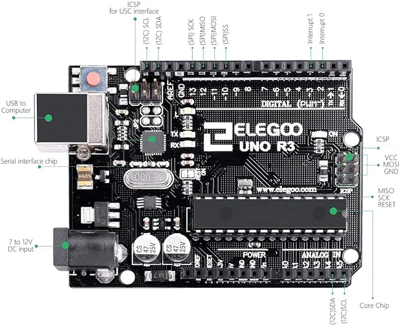

# Section 1 - Data collection

---

**Objective: Using an Arduino and UNO sensors, gather real time data on air quality factors (temperature, humidity, and CO<sub>2</sub>) in this room, and how they vary with the number of occupants in a room.**

An Arduino is a small microcontroller board that you can program to control electronic devices like lights, motors, and sensors.
It is commonly used for hobby projects and prototyping because it is affordable and user-friendly.

## Setting up the hardware

### Components of an Arduino Uno R3


An Arduino is a tiny computer that can connect to electrical circuits. Here is a breakdown of the key components of an Arduiono Uno R3:
- **Atmega 328P chip** (biggest chip on the board): executes programs stored in its (very limited) memory.
- **USB port** - for loading programs onto the chip via the Arduino IDE. Also provides power to the Arduino. 
- **DC input/Power jack**: alternative way to power a **programmed** board (in that case we do not need a USB connection)
- **14 Digital Pins (D0-D13)**: for digital input and output. Pins D0 (RX) and D1 (TX) are also used for serial communication.
- **6 Analog Pins (A0-A5)**: ffor analog input, can read values from sensors that output analog signals.
- **Power Pins**: 5V and 3.3V Output Pins provide power to other components and sensors. whilst the GND Pins grounds pins for completing the circuit.

### Breadboard Basics
- **Power Rails:** The two long rows on each side of the board (marked with red and blue lines) are the power rails, where you connect the 5V and GND from the Arduino.
- **Terminal Strips:** The middle area where you plug in components and wires. Each row of five holes is connected electrically.

### Step-by-Step Wiring Guide

#### 1. Connect Arduino to Breadboard:
   - 5V pin on the Arduino to the positive power rail on the breadboard.
   - GND pin to the negative power rail.

#### 2. Connecting the DHT11 Sensor
   - VCC to 5V power rail on the breadboard, GND to GND rail.
   - Data pin to any free digital pin on the Arduino

#### 3. Connecting the MQ-2 Gas Sensor
   - VCC to 5V power rail on the breadboard, GND to GND rail.
   - A0 pin to the A0 analog input on the Arduino.

#### 4. Connecting the LCD Display
   - VCC to 5V power rail on the breadboard, GND to GND rail.
   - SDA to A4 and SCL to A5 on the Arduino.

### Here is an illustration of this setup:


## Programming the components

**Example of the Arduino programming language**
``` C++
// This is an example of Arduino code
void setup() {
  // This is where you put setup code, which will run once
  pinMode(LED_BUILTIN, OUTPUT);
}

void loop() {
  // This is where your put your main code, to run repeatedly
  digitalWrite(LED_BUILTIN, HIGH);
  delay(1000);
  digitalWrite(LED_BUILTIN, LOW);
  delay(1000);
}
```
---

To use the sensors in conjunction with the Arduino UNO, you will need to use the following code:
``` C++
#include "DHT.h"
#define DHTPIN 2     // Digital pin connected to the DHT sensor - ALTER THIS AS REQUIRED
#define DHTTYPE DHT11   // DHT11 library

DHT dht(DHTPIN, DHTTYPE); // Initialise DHT sensor

// OLED
#include <SPI.h>
#include <Wire.h>
#include <Adafruit_GFX.h>
#include <Adafruit_SH110X.h>

#define i2c_Address 0x3c
#define SCREEN_WIDTH 128 // OLED display width, in pixels
#define SCREEN_HEIGHT 64 // OLED display height, in pixels
#define OLED_RESET -1   //   QT-PY / XIAO
Adafruit_SH1106G display = Adafruit_SH1106G(SCREEN_WIDTH, SCREEN_HEIGHT, &Wire, OLED_RESET);


void setup() {
  Serial.begin(9600); //Set serial baud rate to 9600 bps
  dht.begin();

  delay(250); // wait for the OLED to power up
  display.begin(i2c_Address, true); // Address 0x3C default

  delay(2000);
  display.clearDisplay();   // Clear the buffer.

}


void printText(float h, float t, int val) {
  display.setCursor(0, 0);
  display.println("Humidity: ");
  display.print(h);
  display.println("Temperature: ");
  display.print(t);
  display.println("Gas: ");
  display.print(val);
  display.display();
}


void loop() {
  display.begin(i2c_Address, true);
  display.clearDisplay();
  delay(2000); // Wait a few seconds between measurements.

  // DHT11
  // Reading temperature or humidity takes about 250 milliseconds; sensor readings may take up to 2 seconds to be read
  float h = dht.readHumidity();
  // Read temperature as Celsius (the default)
  float t = dht.readTemperature();

  // Check if any reads failed and exit early (to try again)
  if (isnan(h) || isnan(t)) {
    Serial.println(F("Failed to read from DHT sensor!"));
    return;
  }

  Serial.print(F("Humidity: "));
  Serial.print(h);
  Serial.print(F("%  Temperature: "));
  Serial.print(t);
  Serial.print(F("°C "));

  // Gas sensor
  int val;
  val=analogRead(0); //Read Gas value from analogue 0
  delay(100);
  Serial.println("===========================================================");

  printText(h, t, val);
  display.display();
  delay(500);
  display.clearDisplay();
}
```

